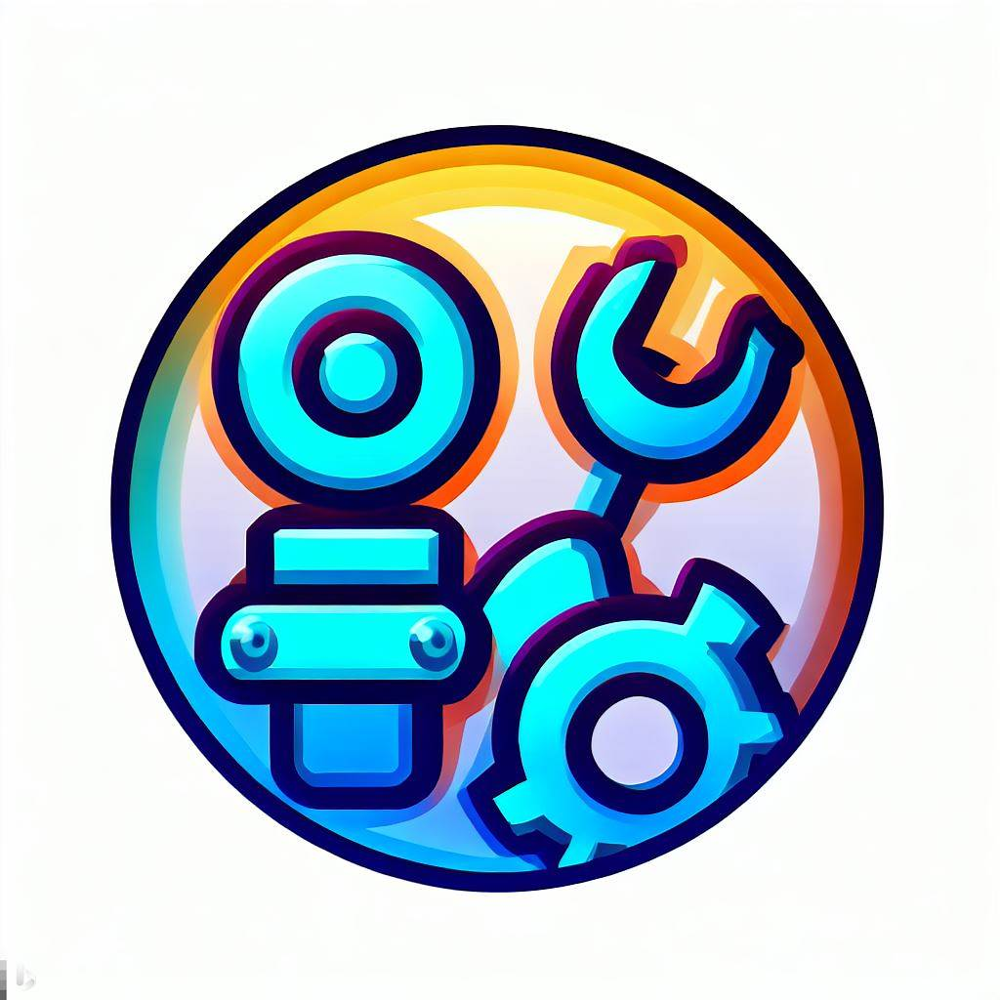

# Automation-App

This application is used to record and play back keyboard and mouse events on your computer. You can use the app to record mouse and keyboard activities and then replay them automatically.

## Key Features

- Record mouse press, release, and movement events.
- Record key press and release events.
- Save recorded events to a file for later playback.
- Playback recorded events with customizable speed and loop count.
- Can open browser.

## Installation Guide

1. **Clone the repository:**

   git clone https://github.com/quyennguyen07/Automation-App.git
   cd your-app

2. **Install dependencies:**

    pip install -r requirements.txt

3. **Run the application:**

    python main.py

## Usage

1. Launch the application.
2. Choose between recording or playing back events.
3. Follow the on-screen instructions to either record or play back events.

## Contributing

Contributions are welcome! If you'd like to add new features, fix bugs, or improve the documentation, feel free to fork the repository and submit a pull request.

## License

This project is licensed under the MIT License - see the LICENSE file for details.

## Contact
For any inquiries or feedback, please contact:

Nguyen Dinh Quyen

Email: nguyendinhquyen000@gmail.com
